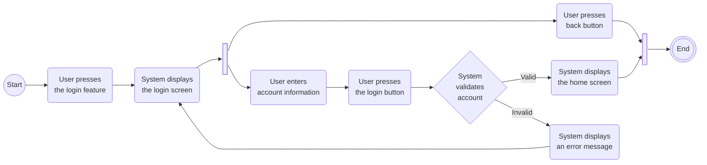
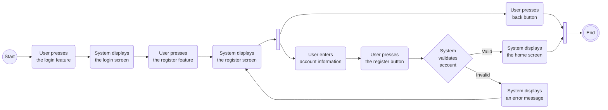
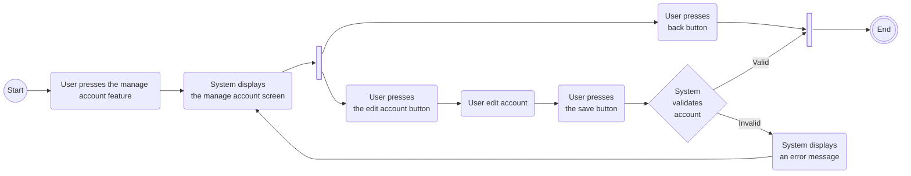
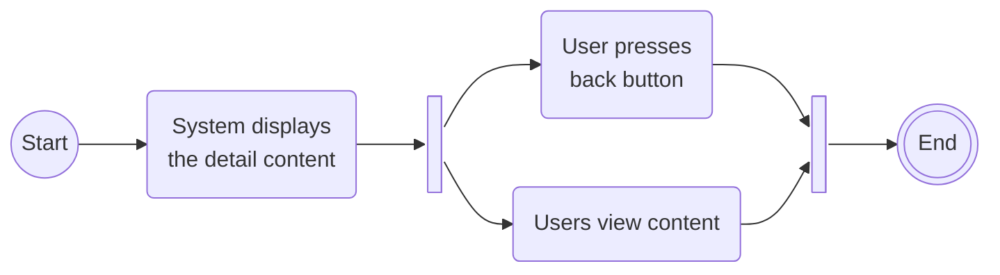
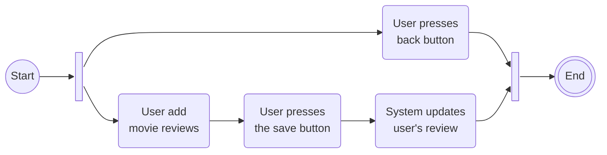
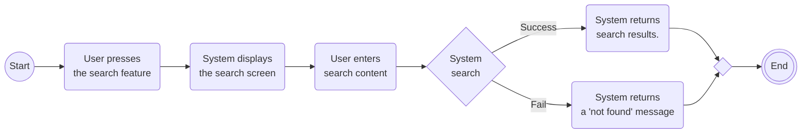
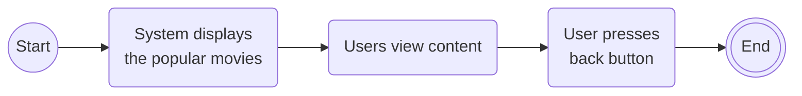
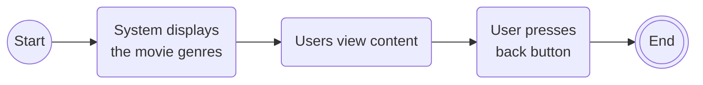
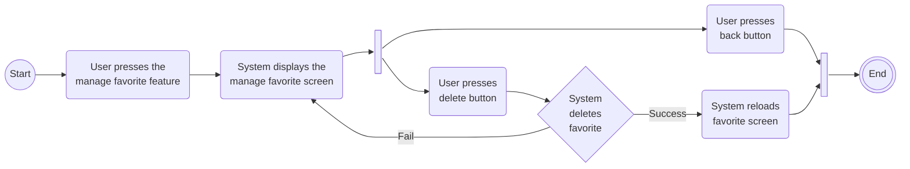
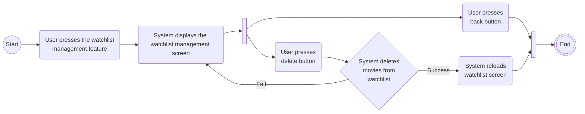

<!-- ```
%%{init: {"flowchart": {"defaultRenderer": "elk"}} }%%
classDef ActivityStyle fill:#fff,stroke:#000
class Activity ActivityStyle
``` -->

## Login


## Register


## Personal account management


## View detailed content


## Movie review


## Search content


## View popular movie


## View genre list


## Remove movie from favorites list


## Remove movie from watchlist

