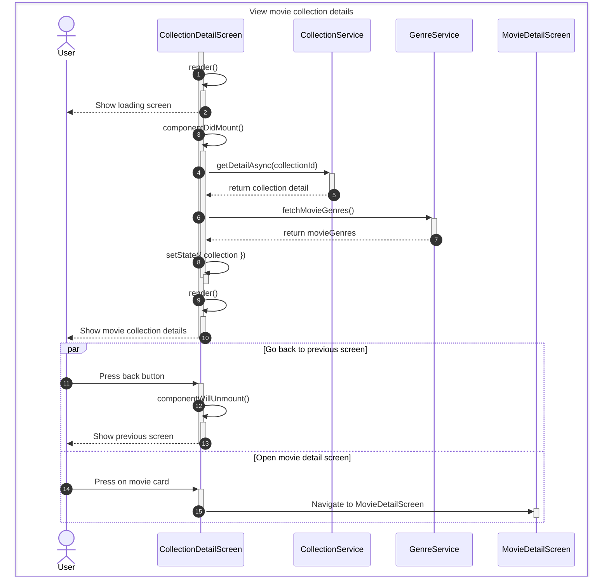

## CollectionDetailScreen

```mermaid
sequenceDiagram
    autonumber
    box View movie collection details
        actor User
        participant MainScreen as CollectionDetailScreen
        participant MainService as CollectionService
        participant GenreService
        participant MovieDetailScreen
    end

    activate MainScreen
        MainScreen->>+MainScreen: render()
        MainScreen-->>-User: Show loading screen

        MainScreen->>+MainScreen: componentDidMount()
            MainScreen->>+MainService: getDetailAsync(collectionId)
            MainService-->>-MainScreen: return collection detail

            MainScreen->>+GenreService: fetchMovieGenres()
            GenreService-->>-MainScreen: return movieGenres

            MainScreen->>+MainScreen: setState({ collection })
            deactivate MainScreen
        deactivate MainScreen

        MainScreen->>+MainScreen: render()
        MainScreen-->>-User: Show movie collection details
    deactivate MainScreen

    par Go back to previous screen
        User->>+MainScreen: Press back button
            MainScreen->>+MainScreen: componentWillUnmount()
            MainScreen-->>-User: Show previous screen
        deactivate MainScreen
    and Open movie detail screen
        User->>+MainScreen: Press on movie card
            MainScreen->>+MovieDetailScreen: Navigate to MovieDetailScreen
            deactivate MovieDetailScreen
        deactivate MainScreen
    end
```
