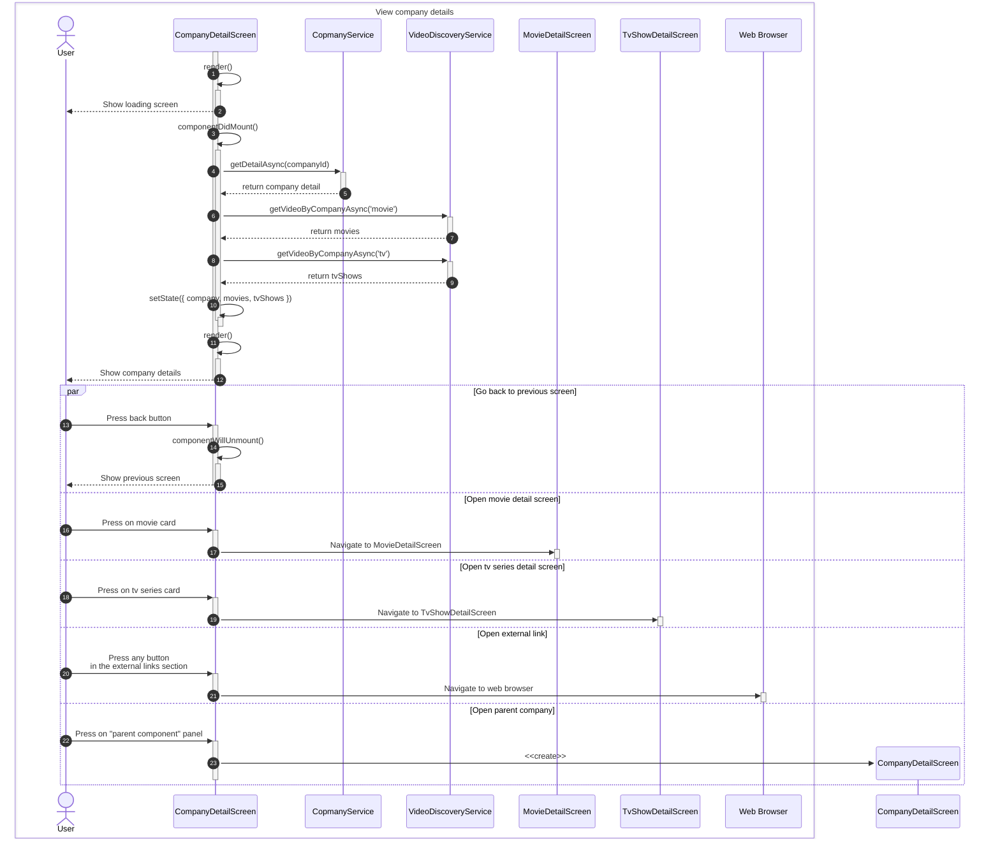

## CompanyDetailScreen

```mermaid
sequenceDiagram
    autonumber
    box View company details
        actor User
        participant MainScreen as CompanyDetailScreen
        participant MainService as CopmanyService
        participant VideoDiscoveryService
        participant MovieDetailScreen
        participant TvShowDetailScreen
        participant Web Browser
    end

    activate MainScreen
        MainScreen->>+MainScreen: render()
        MainScreen-->>-User: Show loading screen

        MainScreen->>+MainScreen: componentDidMount()
            MainScreen->>+MainService: getDetailAsync(companyId)
            MainService-->>-MainScreen: return company detail

            MainScreen->>+VideoDiscoveryService: getVideoByCompanyAsync('movie')
            VideoDiscoveryService-->>-MainScreen: return movies

            MainScreen->>+VideoDiscoveryService: getVideoByCompanyAsync('tv')
            VideoDiscoveryService-->>-MainScreen: return tvShows

            MainScreen->>+MainScreen: setState({ company, movies, tvShows })
            deactivate MainScreen
        deactivate MainScreen

        MainScreen->>+MainScreen: render()
        MainScreen-->>-User: Show company details
    deactivate MainScreen

    par Go back to previous screen
        User->>+MainScreen: Press back button
            MainScreen->>+MainScreen: componentWillUnmount()
            MainScreen-->>-User: Show previous screen
        deactivate MainScreen
    and Open movie detail screen
        User->>+MainScreen: Press on movie card
            MainScreen->>+MovieDetailScreen: Navigate to MovieDetailScreen
            deactivate MovieDetailScreen
        deactivate MainScreen
    and Open tv series detail screen
        User->>+MainScreen: Press on tv series card
            MainScreen->>+TvShowDetailScreen: Navigate to TvShowDetailScreen
            deactivate TvShowDetailScreen
        deactivate MainScreen
    and Open external link
        User->>+MainScreen: Press any button<br/>in the external links section
            MainScreen->>+Web Browser: Navigate to web browser
            deactivate Web Browser
        deactivate MainScreen
    and Open parent company
        User->>+MainScreen: Press on "parent component" panel
            create participant NewMainScreen as CompanyDetailScreen
            MainScreen->>NewMainScreen: <<create>>
        deactivate MainScreen
    end
```
