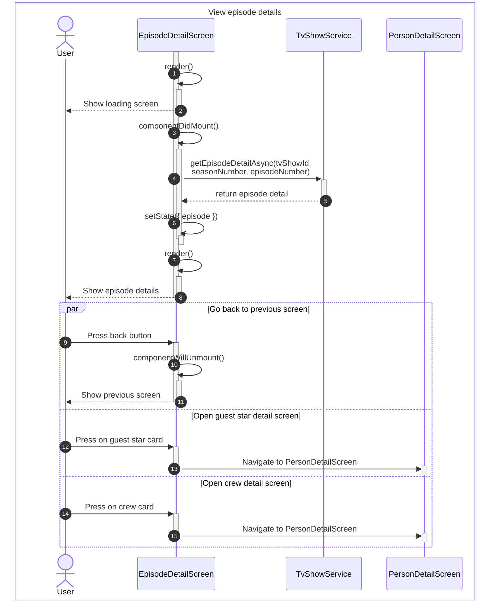

## EpisodeDetailScreen

```mermaid
sequenceDiagram
    autonumber
    box View episode details
        actor User
        participant MainScreen as EpisodeDetailScreen
        participant TvShowService
        participant PersonDetailScreen
    end

    activate MainScreen
        MainScreen->>+MainScreen: render()
        MainScreen-->>-User: Show loading screen

        MainScreen->>+MainScreen: componentDidMount()
            MainScreen->>+TvShowService: getEpisodeDetailAsync(tvShowId,<br/>seasonNumber, episodeNumber)
            TvShowService-->>-MainScreen: return episode detail

            MainScreen->>+MainScreen: setState({ episode })
            deactivate MainScreen
        deactivate MainScreen

        MainScreen->>+MainScreen: render()
        MainScreen-->>-User: Show episode details
    deactivate MainScreen

    par Go back to previous screen
        User->>+MainScreen: Press back button
            MainScreen->>+MainScreen: componentWillUnmount()
            MainScreen-->>-User: Show previous screen
        deactivate MainScreen
    and Open guest star detail screen
        User->>+MainScreen: Press on guest star card
            MainScreen->>+PersonDetailScreen: Navigate to PersonDetailScreen
            deactivate PersonDetailScreen
        deactivate MainScreen
    and Open crew detail screen
        User->>+MainScreen: Press on crew card
            MainScreen->>+PersonDetailScreen: Navigate to PersonDetailScreen
            deactivate PersonDetailScreen
        deactivate MainScreen
    end
```
