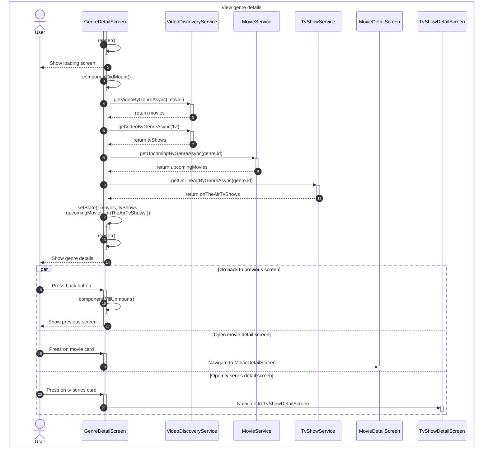

## GenreDetailScreen

```mermaid
sequenceDiagram
    autonumber
    box View genre details
        actor User
        participant MainScreen as GenreDetailScreen
        participant VideoDiscoveryService
        participant MovieService
        participant TvShowService
        participant MovieDetailScreen
        participant TvShowDetailScreen
    end

    activate MainScreen
        MainScreen->>+MainScreen: render()
        MainScreen-->>-User: Show loading screen

        MainScreen->>+MainScreen: componentDidMount()
            MainScreen->>+VideoDiscoveryService: getVideoByGenreAsync('movie')
            VideoDiscoveryService-->>-MainScreen: return movies

            MainScreen->>+VideoDiscoveryService: getVideoByGenreAsync('tv')
            VideoDiscoveryService-->>-MainScreen: return tvShows

            MainScreen->>+MovieService: getUpcomingByGenreAsync(genre.id)
            MovieService-->>-MainScreen: return upcomingMovies

            MainScreen->>+TvShowService: getOnTheAirByGenreAsync(genre.id)
            TvShowService-->>-MainScreen: return onTheAirTvShows

            MainScreen->>+MainScreen: setState({ movies, tvShows,<br/>upcomingMovies, onTheAirTvShows })
            deactivate MainScreen
        deactivate MainScreen

        MainScreen->>+MainScreen: render()
        MainScreen-->>-User: Show genre details
    deactivate MainScreen

    par Go back to previous screen
        User->>+MainScreen: Press back button
            MainScreen->>+MainScreen: componentWillUnmount()
            MainScreen-->>-User: Show previous screen
        deactivate MainScreen
    and Open movie detail screen
        User->>+MainScreen: Press on movie card
            MainScreen->>+MovieDetailScreen: Navigate to MovieDetailScreen
            deactivate MovieDetailScreen
        deactivate MainScreen
    and Open tv series detail screen
        User->>+MainScreen: Press on tv series card
            MainScreen->>+TvShowDetailScreen: Navigate to TvShowDetailScreen
            deactivate TvShowDetailScreen
        deactivate MainScreen
    end
```
