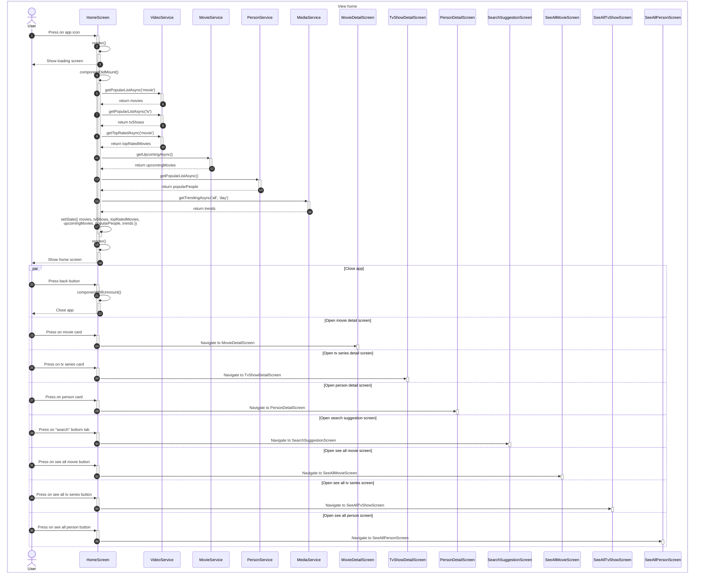

## HomeScreen

```mermaid
sequenceDiagram
    autonumber
    box View home
        actor User
        participant MainScreen as HomeScreen
        participant VideoService
        participant MovieService
        participant PersonService
        participant MediaService
        participant MovieDetailScreen
        participant TvShowDetailScreen
        participant PersonDetailScreen
        participant SearchSuggestionScreen
        participant SeeAllMovieScreen
        participant SeeAllTvShowScreen
        participant SeeAllPersonScreen
    end

    User->>+MainScreen: Press on app icon
        MainScreen->>+MainScreen: render()
        MainScreen-->>-User: Show loading screen

        MainScreen->>+MainScreen: componentDidMount()
            MainScreen->>+VideoService: getPopularListAsync('movie')
            VideoService-->>-MainScreen: return movies

            MainScreen->>+VideoService: getPopularListAsync('tv')
            VideoService-->>-MainScreen: return tvShows

            MainScreen->>+VideoService: getTopRatedAsync('movie')
            VideoService-->>-MainScreen: return topRatedMovies

            MainScreen->>+MovieService: getUpcomingAsync()
            MovieService-->>-MainScreen: return upcomingMovies

            MainScreen->>+PersonService: getPopularListAsync()
            PersonService-->>-MainScreen: return popularPeople

            MainScreen->>+MediaService: getTrendingAsync('all', 'day')
            MediaService-->>-MainScreen: return trends

            MainScreen->>+MainScreen: setState({ movies, tvShows, topRatedMovies,<br/>upcomingMovies, popularPeople, trends })
            deactivate MainScreen
        deactivate MainScreen

        MainScreen->>+MainScreen: render()
        MainScreen-->>-User: Show home screen
    deactivate MainScreen

    par Close app
        User->>+MainScreen: Press back button
            MainScreen->>+MainScreen: componentWillUnmount()
            MainScreen-->>-User: Close app
        deactivate MainScreen
    and Open movie detail screen
        User->>+MainScreen: Press on movie card
            MainScreen->>+MovieDetailScreen: Navigate to MovieDetailScreen
            deactivate MovieDetailScreen
        deactivate MainScreen
    and Open tv series detail screen
        User->>+MainScreen: Press on tv series card
            MainScreen->>+TvShowDetailScreen: Navigate to TvShowDetailScreen
            deactivate TvShowDetailScreen
        deactivate MainScreen
    and Open person detail screen
        User->>+MainScreen: Press on person card
            MainScreen->>+PersonDetailScreen: Navigate to PersonDetailScreen
            deactivate PersonDetailScreen
        deactivate MainScreen
    and Open search suggestion screen
        User->>+MainScreen: Press on "search" bottom tab
            MainScreen->>+SearchSuggestionScreen: Navigate to SearchSuggestionScreen
            deactivate SearchSuggestionScreen
        deactivate MainScreen
    and Open see all movie screen
        User->>+MainScreen: Press on see all movie button
            MainScreen->>+SeeAllMovieScreen: Navigate to SeeAllMovieScreen
            deactivate SeeAllMovieScreen
        deactivate MainScreen
    and Open see all tv series screen
        User->>+MainScreen: Press on see all tv series button
            MainScreen->>+SeeAllTvShowScreen: Navigate to SeeAllTvShowScreen
            deactivate SeeAllTvShowScreen
        deactivate MainScreen
    and Open see all person screen
        User->>+MainScreen: Press on see all person button
            MainScreen->>+SeeAllPersonScreen: Navigate to SeeAllPersonScreen
            deactivate SeeAllPersonScreen
        deactivate MainScreen
    end
```
