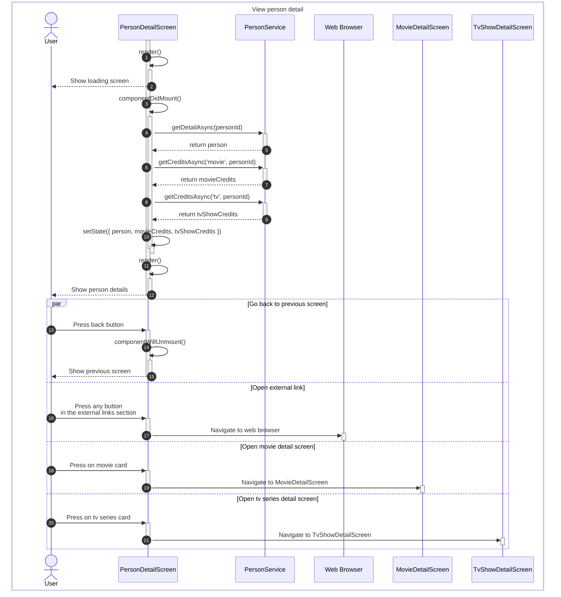

## PersonDetailScreen

```mermaid
sequenceDiagram
    autonumber
    box View person detail
        actor User
        participant MainScreen as PersonDetailScreen
        participant MainService as PersonService
        participant Web Browser
        participant MovieDetailScreen
        participant TvShowDetailScreen
    end

    activate MainScreen
        MainScreen->>+MainScreen: render()
        MainScreen-->>-User: Show loading screen

        MainScreen->>+MainScreen: componentDidMount()
            MainScreen->>+MainService: getDetailAsync(personId)
            MainService-->>-MainScreen: return person

            MainScreen->>+MainService: getCreditsAsync('movie', personId)
            MainService-->>-MainScreen: return movieCredits

            MainScreen->>+MainService: getCreditsAsync('tv', personId)
            MainService-->>-MainScreen: return tvShowCredits

            MainScreen->>+MainScreen: setState({ person, movieCredits, tvShowCredits })
            deactivate MainScreen
        deactivate MainScreen

        MainScreen->>+MainScreen: render()
        MainScreen-->>-User: Show person details
    deactivate MainScreen

    par Go back to previous screen
        User->>+MainScreen: Press back button
            MainScreen->>+MainScreen: componentWillUnmount()
            MainScreen-->>-User: Show previous screen
        deactivate MainScreen
    and Open external link
        User->>+MainScreen: Press any button<br/>in the external links section
            MainScreen->>+Web Browser: Navigate to web browser
            deactivate Web Browser
        deactivate MainScreen
    and Open movie detail screen
        User->>+MainScreen: Press on movie card
            MainScreen->>+MovieDetailScreen: Navigate to MovieDetailScreen
            deactivate MovieDetailScreen
        deactivate MainScreen
    and Open tv series detail screen
        User->>+MainScreen: Press on tv series card
            MainScreen->>+TvShowDetailScreen: Navigate to TvShowDetailScreen
            deactivate TvShowDetailScreen
        deactivate MainScreen
    end
```
