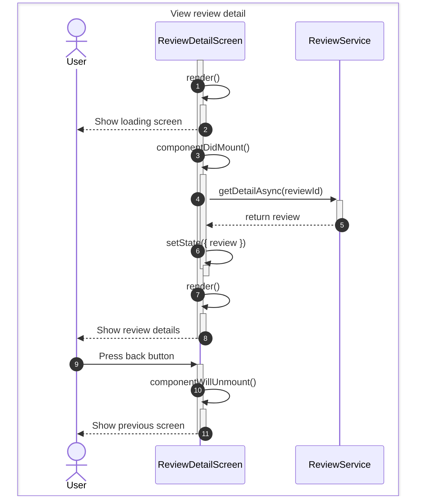

## ReviewDetailScreen

```mermaid
sequenceDiagram
    autonumber
    box View review detail
        actor User
        participant MainScreen as ReviewDetailScreen
        participant MainService as ReviewService
    end

    activate MainScreen
        MainScreen->>+MainScreen: render()
        MainScreen-->>-User: Show loading screen

        MainScreen->>+MainScreen: componentDidMount()
            MainScreen->>+MainService: getDetailAsync(reviewId)
            MainService-->>-MainScreen: return review

            MainScreen->>+MainScreen: setState({ review })
            deactivate MainScreen
        deactivate MainScreen

        MainScreen->>+MainScreen: render()
        MainScreen-->>-User: Show review details
    deactivate MainScreen

    User->>+MainScreen: Press back button
        MainScreen->>+MainScreen: componentWillUnmount()
        MainScreen-->>-User: Show previous screen
    deactivate MainScreen
```
