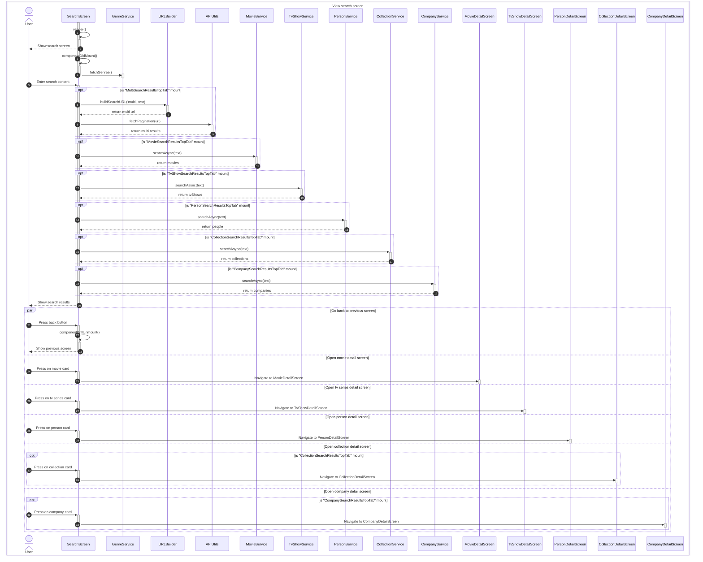

## SearchScreen

```mermaid
sequenceDiagram
    autonumber
    box View search screen
        actor User
        participant MainScreen as SearchScreen
        participant GenreService
        participant URLBuilder
        participant APIUtils
        participant MovieService
        participant TvShowService
        participant PersonService
        participant CollectionService
        participant CompanyService
        participant MovieDetailScreen
        participant TvShowDetailScreen
        participant PersonDetailScreen
        participant CollectionDetailScreen
        participant CompanyDetailScreen
    end

    activate MainScreen
        MainScreen->>+MainScreen: render()
        MainScreen-->>-User: Show search screen

        MainScreen->>+MainScreen: componentDidMount()
            MainScreen->>+GenreService: fetchGenres()
            deactivate GenreService
        deactivate MainScreen
    deactivate MainScreen

    User->>+MainScreen: Enter search content
        opt is "MultiSearchResultsTopTab" mount
            MainScreen->>+URLBuilder: buildSearchURL('multi', text)
            URLBuilder-->>-MainScreen: return multi url

            MainScreen->>+APIUtils: fetchPagination(url)
            APIUtils-->>-MainScreen: return multi results
        end

        opt is "MovieSearchResultsTopTab" mount
            MainScreen->>+MovieService: searchAsync(text)
            MovieService-->>-MainScreen: return movies
        end

        opt is "TvShowSearchResultsTopTab" mount
            MainScreen->>+TvShowService: searchAsync(text)
            TvShowService-->>-MainScreen: return tvShows
        end

        opt is "PersonSearchResultsTopTab" mount
            MainScreen->>+PersonService: searchAsync(text)
            PersonService-->>-MainScreen: return people
        end

        opt is "CollectionSearchResultsTopTab" mount
            MainScreen->>+CollectionService: searchAsync(text)
            CollectionService-->>-MainScreen: return collections
        end

        opt is "CompanySearchResultsTopTab" mount
            MainScreen->>+CompanyService: searchAsync(text)
            CompanyService-->>-MainScreen: return companies
        end
    MainScreen-->>-User: Show search results

    par Go back to previous screen
        User->>+MainScreen: Press back button
            MainScreen->>+MainScreen: componentWillUnmount()
            MainScreen-->>-User: Show previous screen
        deactivate MainScreen
    and Open movie detail screen
        User->>+MainScreen: Press on movie card
            MainScreen->>+MovieDetailScreen: Navigate to MovieDetailScreen
            deactivate MovieDetailScreen
        deactivate MainScreen
    and Open tv series detail screen
        User->>+MainScreen: Press on tv series card
            MainScreen->>+TvShowDetailScreen: Navigate to TvShowDetailScreen
            deactivate TvShowDetailScreen
        deactivate MainScreen
    and Open person detail screen
        User->>+MainScreen: Press on person card
            MainScreen->>+PersonDetailScreen: Navigate to PersonDetailScreen
            deactivate PersonDetailScreen
        deactivate MainScreen
    and Open collection detail screen
        opt is "CollectionSearchResultsTopTab" mount
            User->>+MainScreen: Press on collection card
                MainScreen->>+CollectionDetailScreen: Navigate to CollectionDetailScreen
                deactivate CollectionDetailScreen
            deactivate MainScreen
        end
    and Open company detail screen
        opt is "CompanySearchResultsTopTab" mount
            User->>+MainScreen: Press on company card
                MainScreen->>+CompanyDetailScreen: Navigate to CompanyDetailScreen
                deactivate CompanyDetailScreen
            deactivate MainScreen
        end
    end
```
