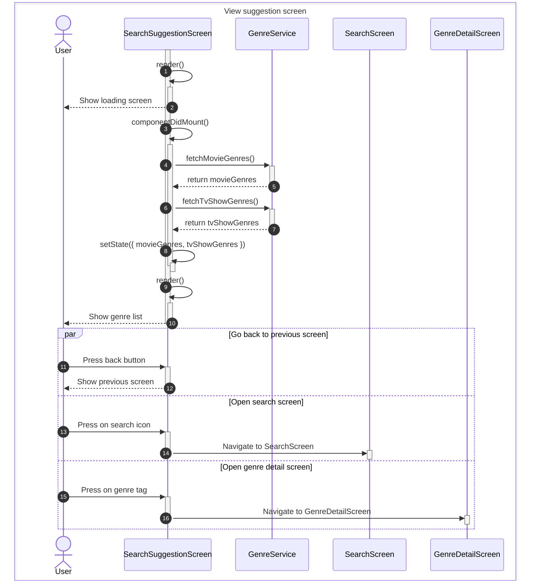

## SearchSuggestionScreen

```mermaid
sequenceDiagram
    autonumber
    box View suggestion screen
        actor User
        participant MainScreen as SearchSuggestionScreen
        participant GenreService
        participant SearchScreen
        participant GenreDetailScreen
    end

    activate MainScreen
        MainScreen->>+MainScreen: render()
        MainScreen-->>-User: Show loading screen

        MainScreen->>+MainScreen: componentDidMount()
            MainScreen->>+GenreService: fetchMovieGenres()
            GenreService-->>-MainScreen: return movieGenres

            MainScreen->>+GenreService: fetchTvShowGenres()
            GenreService-->>-MainScreen: return tvShowGenres

            MainScreen->>+MainScreen: setState({ movieGenres, tvShowGenres })
            deactivate MainScreen
        deactivate MainScreen

        MainScreen->>+MainScreen: render()
        MainScreen-->>-User: Show genre list
    deactivate MainScreen

    par Go back to previous screen
        User->>+MainScreen: Press back button
        MainScreen-->>-User: Show previous screen
    and Open search screen
        User->>+MainScreen: Press on search icon
            MainScreen->>+SearchScreen: Navigate to SearchScreen
            deactivate SearchScreen
        deactivate MainScreen
    and Open genre detail screen
        User->>+MainScreen: Press on genre tag
            MainScreen->>+GenreDetailScreen: Navigate to GenreDetailScreen
            deactivate GenreDetailScreen
        deactivate MainScreen
    end
```
