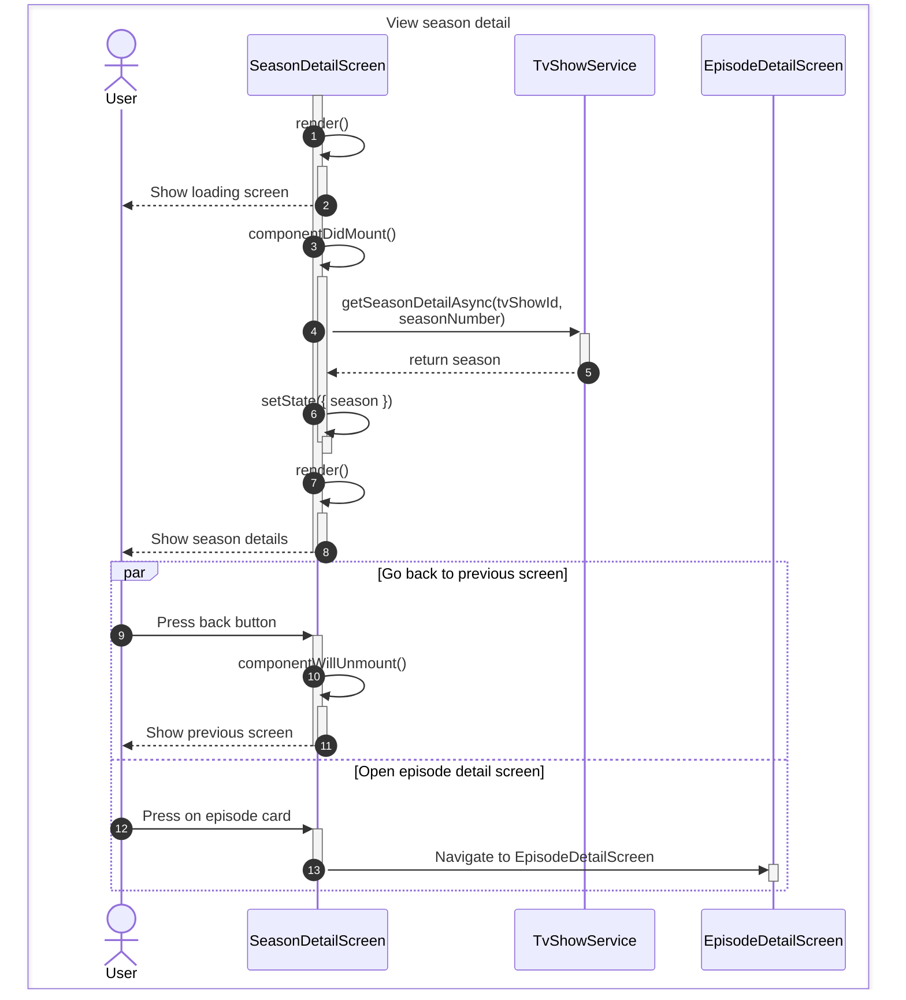

## SeasonDetailScreen

```mermaid
sequenceDiagram
    autonumber
    box View season detail
        actor User
        participant MainScreen as SeasonDetailScreen
        participant MainService as TvShowService
        participant EpisodeDetailScreen
    end

    activate MainScreen
        MainScreen->>+MainScreen: render()
        MainScreen-->>-User: Show loading screen

        MainScreen->>+MainScreen: componentDidMount()
            MainScreen->>+MainService: getSeasonDetailAsync(tvShowId,<br/>seasonNumber)
            MainService-->>-MainScreen: return season

            MainScreen->>+MainScreen: setState({ season })
            deactivate MainScreen
        deactivate MainScreen

        MainScreen->>+MainScreen: render()
        MainScreen-->>-User: Show season details
    deactivate MainScreen

    par Go back to previous screen
        User->>+MainScreen: Press back button
            MainScreen->>+MainScreen: componentWillUnmount()
            MainScreen-->>-User: Show previous screen
        deactivate MainScreen
    and Open episode detail screen
        User->>+MainScreen: Press on episode card
            MainScreen->>+EpisodeDetailScreen: Navigate to EpisodeDetailScreen
            deactivate EpisodeDetailScreen
        deactivate MainScreen
    end
```
