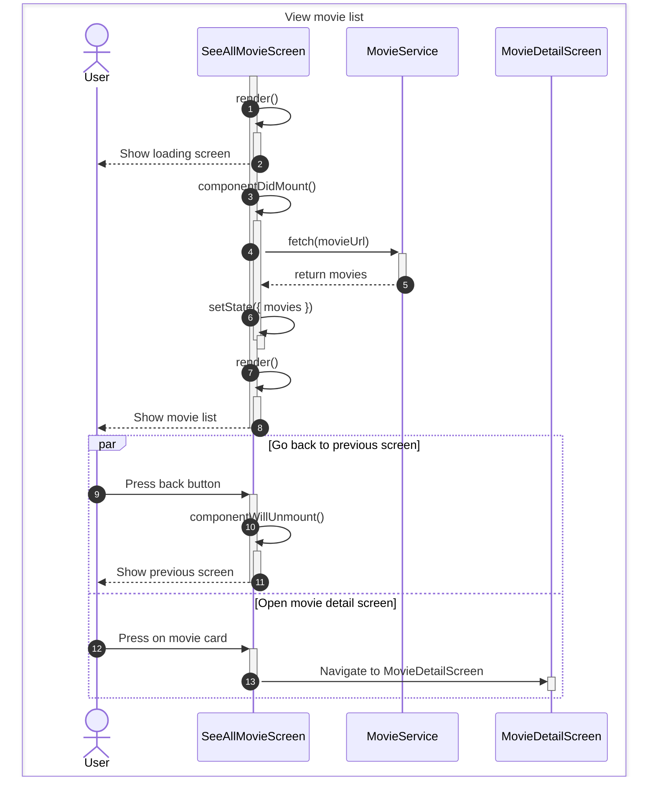

## SeeAllMovieScreen

```mermaid
sequenceDiagram
    autonumber
    box View movie list
        actor User
        participant MainScreen as SeeAllMovieScreen
        participant MainService as MovieService
        participant MovieDetailScreen
    end

    activate MainScreen
        MainScreen->>+MainScreen: render()
        MainScreen-->>-User: Show loading screen

        MainScreen->>+MainScreen: componentDidMount()
            MainScreen->>+MainService: fetch(movieUrl)
            MainService-->>-MainScreen: return movies

            MainScreen->>+MainScreen: setState({ movies })
            deactivate MainScreen
        deactivate MainScreen

        MainScreen->>+MainScreen: render()
        MainScreen-->>-User: Show movie list
    deactivate MainScreen

    par Go back to previous screen
        User->>+MainScreen: Press back button
            MainScreen->>+MainScreen: componentWillUnmount()
            MainScreen-->>-User: Show previous screen
        deactivate MainScreen
    and Open movie detail screen
        User->>+MainScreen: Press on movie card
            MainScreen->>+MovieDetailScreen: Navigate to MovieDetailScreen
            deactivate MovieDetailScreen
        deactivate MainScreen
    end
```
