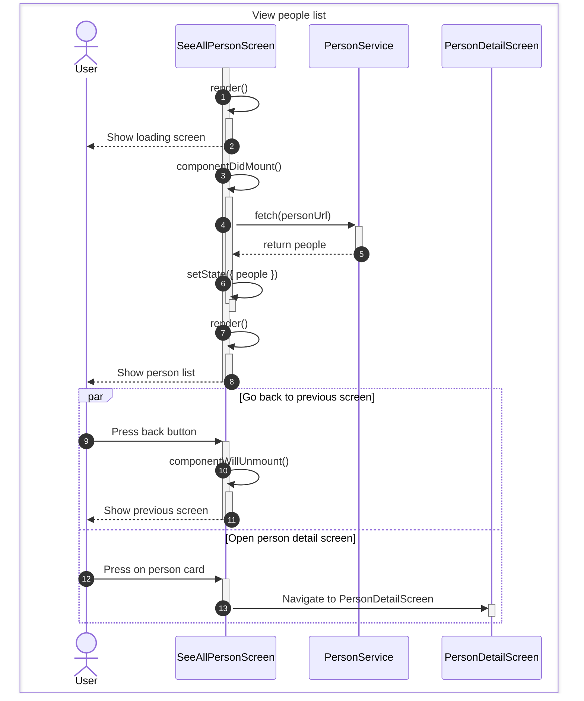

## SeeAllPersonScreen

```mermaid
sequenceDiagram
    autonumber
    box View people list
        actor User
        participant MainScreen as SeeAllPersonScreen
        participant MainService as PersonService
        participant PersonDetailScreen
    end

    activate MainScreen
        MainScreen->>+MainScreen: render()
        MainScreen-->>-User: Show loading screen

        MainScreen->>+MainScreen: componentDidMount()
            MainScreen->>+MainService: fetch(personUrl)
            MainService-->>-MainScreen: return people

            MainScreen->>+MainScreen: setState({ people })
            deactivate MainScreen
        deactivate MainScreen

        MainScreen->>+MainScreen: render()
        MainScreen-->>-User: Show person list
    deactivate MainScreen

    par Go back to previous screen
        User->>+MainScreen: Press back button
            MainScreen->>+MainScreen: componentWillUnmount()
            MainScreen-->>-User: Show previous screen
        deactivate MainScreen
    and Open person detail screen
        User->>+MainScreen: Press on person card
            MainScreen->>+PersonDetailScreen: Navigate to PersonDetailScreen
            deactivate PersonDetailScreen
        deactivate MainScreen
    end
```
