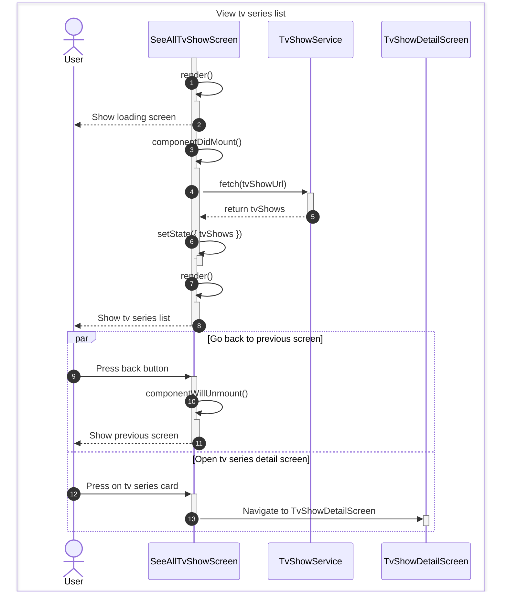

## SeeAllTvShowScreen

```mermaid
sequenceDiagram
    autonumber
    box View tv series list
        actor User
        participant MainScreen as SeeAllTvShowScreen
        participant MainService as TvShowService
        participant TvShowDetailScreen
    end

    activate MainScreen
        MainScreen->>+MainScreen: render()
        MainScreen-->>-User: Show loading screen

        MainScreen->>+MainScreen: componentDidMount()
            MainScreen->>+MainService: fetch(tvShowUrl)
            MainService-->>-MainScreen: return tvShows

            MainScreen->>+MainScreen: setState({ tvShows  })
            deactivate MainScreen
        deactivate MainScreen

        MainScreen->>+MainScreen: render()
        MainScreen-->>-User: Show tv series list
    deactivate MainScreen

    par Go back to previous screen
        User->>+MainScreen: Press back button
            MainScreen->>+MainScreen: componentWillUnmount()
            MainScreen-->>-User: Show previous screen
        deactivate MainScreen
    and Open tv series detail screen
        User->>+MainScreen: Press on tv series card
            MainScreen->>+TvShowDetailScreen: Navigate to TvShowDetailScreen
            deactivate TvShowDetailScreen
        deactivate MainScreen
    end
```
