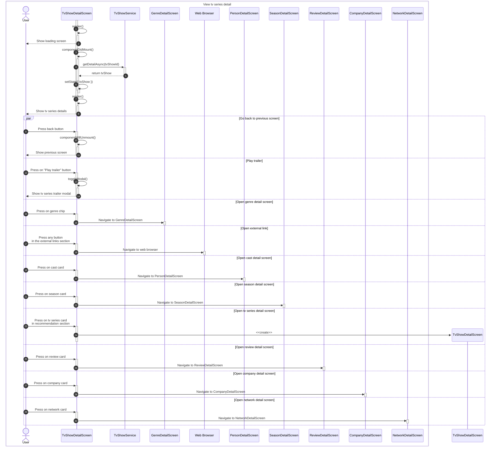

## TvShowDetailScreen

```mermaid
sequenceDiagram
    autonumber
    box View tv series detail
        actor User
        participant MainScreen as TvShowDetailScreen
        participant MainService as TvShowService
        participant GenreDetailScreen
        participant Web Browser
        participant PersonDetailScreen
        participant SeasonDetailScreen
        participant ReviewDetailScreen
        participant CompanyDetailScreen
        participant NetworkDetailScreen
    end

    activate MainScreen
        MainScreen->>+MainScreen: render()
        MainScreen-->>-User: Show loading screen

        MainScreen->>+MainScreen: componentDidMount()
            MainScreen->>+MainService: getDetailAsync(tvShowId)
            MainService-->>-MainScreen: return tvShow

            MainScreen->>+MainScreen: setState({ tvShow })
            deactivate MainScreen
        deactivate MainScreen

        MainScreen->>+MainScreen: render()
        MainScreen-->>-User: Show tv series details
    deactivate MainScreen

    par Go back to previous screen
        User->>+MainScreen: Press back button
            MainScreen->>+MainScreen: componentWillUnmount()
            MainScreen-->>-User: Show previous screen
        deactivate MainScreen
    and Play trailer
        User->>+MainScreen: Press on "Play trailer" button
            MainScreen->>+MainScreen: toggleModal()
            MainScreen-->>-User: Show tv series trailer modal
        deactivate MainScreen
    and Open genre detail screen
        User->>+MainScreen: Press on genre chip
            MainScreen->>+GenreDetailScreen: Navigate to GenreDetailScreen
            deactivate GenreDetailScreen
        deactivate MainScreen
    and Open external link
        User->>+MainScreen: Press any button<br/>in the external links section
            MainScreen->>+Web Browser: Navigate to web browser
            deactivate Web Browser
        deactivate MainScreen
    and Open cast detail screen
        User->>+MainScreen: Press on cast card
            MainScreen->>+PersonDetailScreen: Navigate to PersonDetailScreen
            deactivate PersonDetailScreen
        deactivate MainScreen
    and Open season detail screen
        User->>+MainScreen: Press on season card
            MainScreen->>+SeasonDetailScreen: Navigate to SeasonDetailScreen
            deactivate SeasonDetailScreen
        deactivate MainScreen
    and Open tv series detail screen
        User->>+MainScreen: Press on tv series card<br/>in recommendation section
            create participant NewMainScreen as TvShowDetailScreen
            MainScreen->>NewMainScreen: <<create>>
        deactivate MainScreen
    and Open review detail screen
        User->>+MainScreen: Press on review card
            MainScreen->>+ReviewDetailScreen: Navigate to ReviewDetailScreen
            deactivate ReviewDetailScreen
        deactivate MainScreen
    and Open company detail screen
        User->>+MainScreen: Press on company card
            MainScreen->>+CompanyDetailScreen: Navigate to CompanyDetailScreen
            deactivate CompanyDetailScreen
        deactivate MainScreen
    and Open network detail screen
        User->>+MainScreen: Press on network card
            MainScreen->>+NetworkDetailScreen: Navigate to NetworkDetailScreen
            deactivate NetworkDetailScreen
        deactivate MainScreen
    end
```
