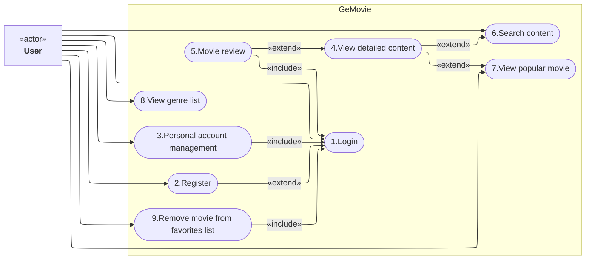

## Functional usecase
> Attention: Use case diagrams are not supported in Mermaid, check this [issue](https://github.com/mermaid-js/mermaid/issues/4628). I have implemented a `flowchart` instead. I will update the diagram if Mermaid supports it.

